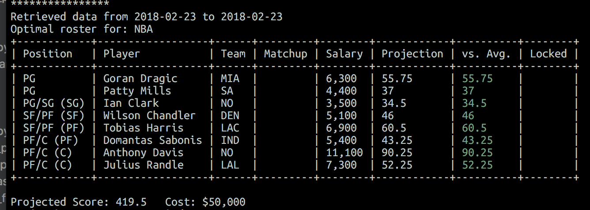

## Introduction &middot; [](https://travis-ci.org/BenBrostoff/draft-kings-fun) &middot; [](https://draftfast.herokuapp.com/) &middot; [](https://www.patreon.com/user?u=8965834)

[*Blog*](https://medium.com/draftfast) &middot; [*Web UI Demo*](https://motm-stats.firebaseapp.com/) &middot; [*Slack Channel*](https://draftfast.herokuapp.com/)


This is an incredibly powerful tool that can automate lineup building, allowing you to enter thousands of lineups in any DK contest in the time it takes you to grab a coffee.

This project allows you to create an unlimited amount of optimized DraftKings lineups based on any projection source of your choice. You can use this repo as a command line application, or import functionality as needed to build your own scripts to construct thousands of DraftKings lineups each week and upload them in seconds using their [CSV upload tool](https://www.draftkings.com/lineup/upload). Examples of how to do the latter are provided in the `examples` directory.

Special thanks to [swanson](https://github.com/swanson/), who authored [this repo](https://github.com/swanson/degenerate), which mine is heavily based off of.

Pre-reqs:

* Python 2 but NOT Python 3 compatible yet (currently working on implementation)
* [ortools](https://developers.google.com/optimization/installing?hl=en)
* `pip install -r requirements.txt`

To run, download your desired week's salaries on DraftKings, and then run:

```
bash scripts/prepare_nfl_contest_data.sh
```

Note that this script will error out if the CSV from DraftKings is not in `~/Downloads`.

Next, scrape data from FantasyPros or Rotogrinders and allow for some mismatched data between the two sources:

```
python optimize.py -mp 100 -s y -source nfl_rotogrinders
```

Or, use your own projection source:

```
python optimize.py -mp 100 -s n -projection_file "/Users/benbrostoff/Downloads/my_projections.csv"
```

Note that any projection file you provide must include `playername` and `points` as header names.

One important note here is that passing in <code>y</code> for the scrape option will create <code>current-projections.csv</code>. However, once you've scraped once, there's no need to do again.

## Optimization Options

Force a QB/WR or QB/TE combination from a particular team. For instance, if I wanted a guaranteed Cam Newton / Greg Olsen duo:

```
python optimize.py -mp 100 -duo CAR -dtype TE
```

Another example pairing Antonio Brown and Ben Roethlisberger:

```
python optimize.py -mp 100 -duo PIT -dtype WR
```

Limit same team representation except for QB / skill player combos. Example:

```
python optimize.py -mp 100 -limit y
```

Run the optimizer multiple times and continually eliminate pre-optimized players from the lineup. For instance, to run three different iterations and generate three different sets of players:

```
python optimize.py -i 3
```

At any time, you can get a list of all possible options via:

```
python optimize.py --help
```

## Generating CSV for uploading multiple lineups to DraftKings

DraftKings allows uploading up to 500 lineups using a single CSV file. [You can learn more about DraftKings' support for lineup uploads here.](https://playbook.draftkings.com/news/draftkings-lineup-upload-tool) This tool supports
generating an uploadable CSV file containing the generated optimized lineups.

To use this feature:

1. Download the weekly salaries CSV from DraftKings
(containing player name, DK-estimated points, salary, etc).
2. Run `bash scripts/prepare_<nba/nfl>_contest_data.sh`.
3. Download the [CSV upload template](https://www.draftkings.com/lineup/upload) and get the file location (probably something like `~/Downloads/DKSalaries.csv`). *Note - this file has the same name as the weekly salaries CSV when downloaded from DraftKings, which can be confusing.*
4. Run `python optimize.py -pids <upload_tpl_location>`. Remember to specify league, constraints, number of iterations to run, etc.
5. Upload the newly generated file to DraftKings from `data/current-upload.csv`.

One nice workflow is to run the optimizer with the `-keep_pids` flag after you create your CSV; this option will put future optimizations in the same CSV file.

## Projected Ownership Percentages (Experimental)

Projected ownership percentages as of this writing could be downloaded from [DFS Report](https://dfsreport.com/draftkings-ownership-percentages). If you download the CSV, you can filter on projected ownership percentage. For example, only include players below 15% owned.

```
python optimize.py -po_location 'data/ownership.csv' -po 15
```

## MLB (NEW! April 2018)

After downloading the DraftKings salaries for a contest:

```
bash scripts/prepare_contest_data.sh
```

Currently, Rotogrinders is the only available datasource that can be scraped:

```
python optimize.py -league MLB -source mlb_rotogrinders
```

## NBA

An NBA option exists for NBA contests. After downloading the DraftKings salaries for a contest:

```
bash scripts/prepare_contest_data.sh
```

Currently, Rotogrinders and Numberfire are the only available datasources:

```
python optimize.py -league NBA -source nba_rotogrinders
python optimize.py -league NBA -source nba_number_fire
```

## WNBA

A WNBA option is available, but users must provide their own projection source:

```
bash scripts/prepare_contest_data.sh
python optimize.py -league WNBA -projection_file "/Users/benbrostoff/Downloads/my_projections.csv" -s No
```

## Pick'Em (NEW! January 2018)

Pick'Em contests allow players to pick one player in each of six tiers. After downloading a salaries file:

```
bash scripts/prepare_contest_data.sh
python pickem_optimize.py
```

## Historical Optimization (NEW! February 2018)

Interested in knowing the best possible lineup for a given day? The `-historical_date` flag will allow you
to experiment with data from previous contests. Example:

```
python optimize.py -league NBA -historical_date "2018-02-23"
```

The results can show some amazingly high scores and lead to critical insights about how to structure lineups:



This flag only works for NBA and the data collected from the `draft_kings_nba` module.

For a list of available flags and filters:

```
python pickem_optimize.py --help
```

You can also automate lineup construction for Pick'Em contests. It is recommended you do this via scripting versus the CLI. An example is shown in `examples/random_pickem_nba.py`.

Note that for all CSV lineup uploads, you need to download the the [template for the day's games here](https://www.draftkings.com/lineup/upload). Make sure to switch the sport to *NBA* and style to *Pick Em*.
